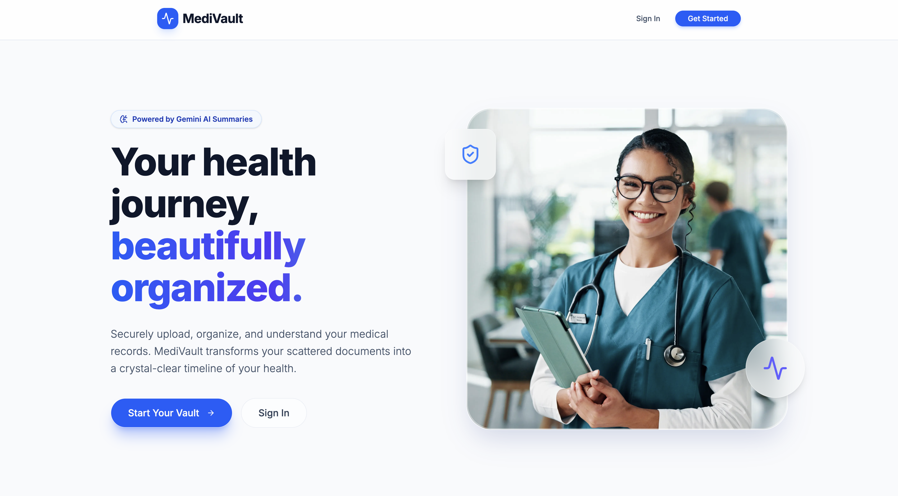
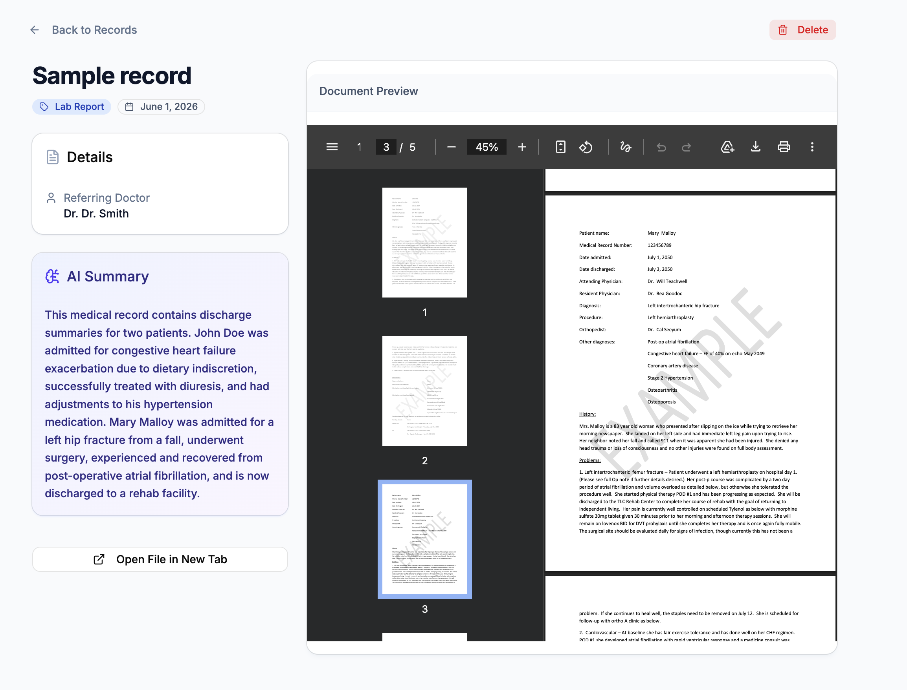
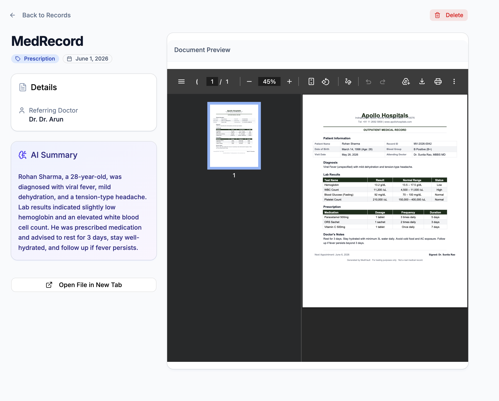
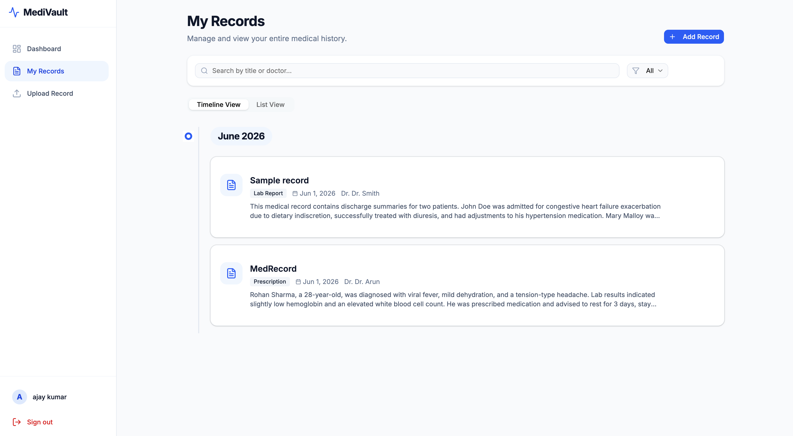
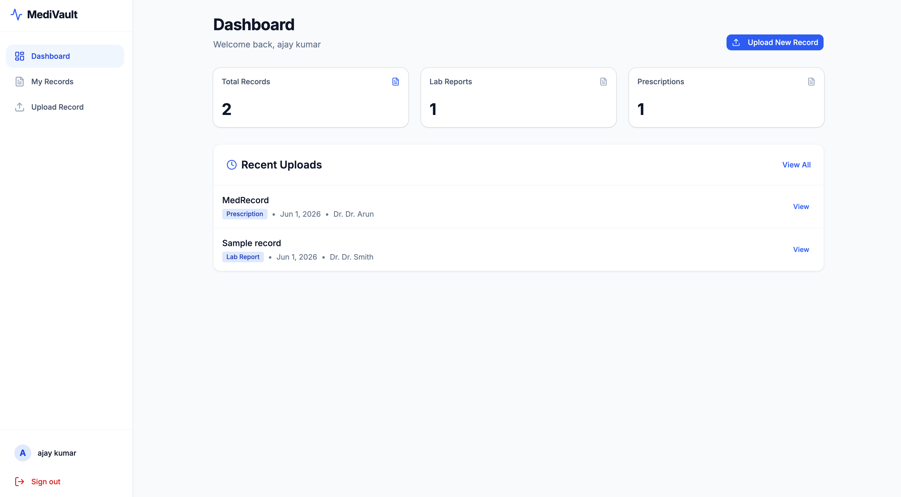

# MediVault - Smart Medical Record Organizer

## About
MediVault is a full-stack, AI-powered medical record organizer designed to help you securely manage your health data. It allows users to seamlessly upload, organize, and view their medical records in one centralized location. By leveraging advanced AI, MediVault extracts key insights and simplifies complex medical jargon, making your health information easy to understand.

## Features
- **Smart Organization:** Securely upload, categorize, and store medical records, lab results, and prescriptions.
- **AI-Powered Insights:** Utilize advanced AI (Google GenAI) to summarize and explain complex medical documents in plain language.
- **Secure Authentication:** Robust user authentication and data protection powered by NextAuth.js.
- **Modern Dashboard:** A sleek, responsive, and highly intuitive user interface built with Next.js, Tailwind CSS, and shadcn/ui.
- **Cloud Storage:** Reliable, scalable, and secure document storage using Vercel Blob.

## How it helps
- **Centralized Health Data:** Eliminates the hassle of fragmented paper records by keeping all your medical history in one secure digital vault.
- **Better Understanding:** Demystifies complex medical terminology and lab results, empowering you to take control of your health.
- **Preparedness:** Ensures your critical health information is always organized and readily accessible for your next doctor's appointment.
- **Peace of Mind:** Provides a secure environment for your most sensitive data with modern authentication and cloud storage practices.

## Tech Stack
- **Frontend Framework:** [Next.js](https://nextjs.org/) (App Router) & [React 19](https://react.dev/)
- **Language:** [TypeScript](https://www.typescriptlang.org/)
- **Styling & UI:** [Tailwind CSS v4](https://tailwindcss.com/), [shadcn/ui](https://ui.shadcn.com/), [Framer Motion](https://www.framer.com/motion/)
- **Backend & API:** Next.js API Routes
- **Authentication:** [NextAuth.js](https://next-auth.js.org/) & bcryptjs
- **Database ORM:** [Prisma](https://www.prisma.io/)
- **AI Integration:** [Google GenAI SDK](https://ai.google.dev/)
- **Cloud Storage:** [Vercel Blob](https://vercel.com/docs/storage/vercel-blob)
- **Forms & Validation:** [React Hook Form](https://react-hook-form.com/) & [Zod](https://zod.dev/)
